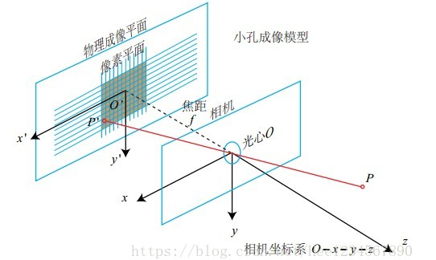
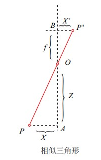

相机成像的过程实际是将真实的三维空间中的三维点映射到成像平面（二维空间）过程，可以简单的使用小孔成像模型来描述该过程，以了解成像过程中三维空间到二位图像空间的变换过程。

本文包含两部分内容，首先介绍小孔成像模型的各种几何关系；接着描述了成像过程中的四种坐标系（像素坐标，图像坐标，相机坐标，世界坐标）的变换关系。

<!--- more --->

## 小孔成像模型

相机可以抽象为最简单的形式：一个小孔和一个成像平面，小孔位于成像平面和真实的三维场景之间，任何来自真实世界的光只有通过小孔才能到达成像平面。因此，在成像平面和通过小孔看到的真实三维场景存在着一种对应关系，也就是图像中的二维像点和真实三维世界的三维点存在某种变换关系。找到了这种变换关系，就可以利用图像中的二维点信息来恢复场景的三维信息。

下图是小孔成像的模型，为了简化模型，将成像平面放在了小孔的前面，并且成的像也是正立的

在描述小孔的成像过程前，首先来定义两个坐标系：

### 相机坐标系（三维坐标系）

相机的中心被称为焦点或者光心，以焦点$O_c$为原点和坐标轴$X_c$,$Y_c$,$Z_c$组成了相机坐标系

### 图像坐标系（二维坐标系）

成像平面中，以成像平面的中心O'为原点和坐标轴x',y'组成了图像坐标系。小孔成像实际就是将相机坐标系中的三维点变换到成像平面中的图像坐标系中的二维点。

假设，三维空间中点P，其在相机坐标系中的坐标是$P_c=[X,Y,Z]^T$；其像点p，在图像坐标系的中的坐标是$p=[x,y]^T$，由于光轴垂直与成像平面，那么可以知道像点p在相机坐标系中的坐标是$p=[x,y,z]^T$,其中z =f(f是焦点到成像平面之间的距离，被称为焦距)。

由上图根据三角形的相似关系，可以得到如下公式：
$$\frac{Z}{f}=\frac{X}{x}=\frac{Y}{y}$$
将上面公式整理后可以得到：
$$\left\{\begin{array}{l}x = f\frac{X}{Z}\\y = f\frac{Y}{Z}\\z = f\end{array}\right.​$$
上面的公式就是小孔相机模型的基础公式了，有了此公式可以推导出更详细的小孔相机模型的参数：** 内参数和外参数 **。

在推导相机的内参数和外参数前，需要先了解下齐次坐标的概念。

## 齐次坐标

相机的成像过程实际是将三维空间的点P=(X,Y,Z)变换到成像平面的过程，这个过程也可以被称为射影变换（更多关于射影变换的内容可参考《计算机视觉中的多视图几何》）。如上面描述的，设射影变换的中心O作为相机坐标系的原点，该点到成像平面的距离为f，P在成像平面的投影点为p=(x,y)，根据相似三角形原理，可以得到公式：
$$\left\{
\begin{array}{l}
x = f\frac{X}{Z} \\
y = f\frac{Y}{Z} \\
z = f
\end{array}
\right.$$

上面的公式就描述了三位空间到二维平面的映射，但是该映射对于坐标Z来说却是非线性（作为分母），通过上面的公式方便的统一处理X,Y,Z这三个坐标轴的数据。就需要引入新的坐标（扩展坐标的维度）将其线性化，如下：
$$\left[\begin{array}{c}x\\y\end{array}\right] \Leftrightarrow
\left[\begin{array}{c}\hat{x}\\\hat{y}\\\hat{z}\end{array}\right] =
\left[\begin{array}{ccc}f&0&0&0\\0&f&0&0\\0&0&1&0\end{array}\right]
\left[\begin{array}{c}X\\Y\\Z\\1\end{array}\right]$$

这样，可以使用矩阵的乘法统一的处理X,Y,Z这三个坐标。
坐标$$(\hat{x},\hat{y},\hat{z})$$就是像点p=(x,y)的齐次坐标，其中
$$\left\{\begin{array}{l}x=\frac{\hat{x}}{\hat{z}}\\y=\frac{\hat{y}}{\hat{z}}
\\z\ne0\end{array}\right.$$

通过上面的公式可以很容易的推导出，怎么通过扩展坐标维度构建齐次坐标。具体步骤就是将x和y同时除以一个不为0的z，并且将z作为其添加维度的坐标，通常可以选择z=1。
这就可以发现其次坐标的一个重要性质，齐次坐标缩放一个常量因子是不变：
$$s(a,b,c)^T=(sa,sb,sc)^T$$

## 内参数

相机的内参数由下面的两部分组成：射影变换本身的参数，相机的焦点到成像平面的距离，也就是焦距f。从成像平面坐标系到像素坐标系的变换。上面推导中使用的像点坐标p=(x,y)是成像平面坐标系下，以成像平面的中心为原点。

而实际像素点的表示方法是以像素来描述，坐标原点通常是图像的左上角，X轴沿着水平方向向左，Y轴竖直向下。像素是一个矩形块，这里假设其在水平和竖直方向的长度分别为：$\alpha$和$\beta$。所以像素坐标和成像平面坐标之间，相差了一个缩放和原点的平移。

假设像素坐标的水平方向的轴为$\mu$，竖直方向的轴为$\nu$，那么将一个成像平面的坐标(x,y)在水平方向上缩放$\alpha$倍，在竖直方向上缩放$\beta$倍，同时平移$(c_x,c_y)$，就可以得到像素坐标系的坐标$(\mu,\nu)$，其公式如下：
$$\begin{array}{c}
u = \alpha\cdot x+ c_x\\
v = \beta \cdot y + c_y
\end{array}$$

将上面求得的(x,y)带入上面公式可得到：
$$\left\{\begin{array}{c}
u = \alpha\cdot f\frac{X}{Z}+ c_x \\
v = \beta \cdot f\frac{Y}{Z} + c_y
\end{array}\right. \Rightarrow \left\{\begin{array}{c}
u = f_x\frac{X}{Z}+ c_x \\
v = f_y\frac{Y}{Z} + c_y
\end{array}\right.$$
其中，$f_x = \alpha \cdot f$,$f_y = \beta \cdot f$

将上面的公式写为齐次坐标的形式：
$$\left[\begin{array}{c}\mu\\\nu\\1\end{array}\right] = \frac{1}{Z}\left[
\begin{array}{ccc}f_x&0&c_x\\0&f_y&c_y\\0&0&1\end{array}\right]\left[\begin{array}{c}X\\Y\\Z\end{array}\right]$$

上面提到对于齐次坐标，缩放一个常量因子仍然是相等的，将Z挪到左边
$$\left[\begin{array}{c}\mu\\\nu\\1\end{array}\right]=Z\left[\begin{array}{c}\mu\\\nu\\1\end{array}\right] =\left[
\begin{array}{ccc}f_x&0&c_x\\0&f_y&c_y\\0&0&1\end{array}\right]\left[\begin{array}{c}X\\Y\\Z\end{array}\right]$$

通过上面的的推导，就得到了相机的内参数矩阵（Camera Intrinsics）K，
$$K=\left[\begin{array}{ccc}f_x&0&c_x\\0&f_y&c_y\\0&0&1\end{array}\right]$$
K有4个未知数和相机的构造相关，$f_x$,$f_y$和相机的焦距，像素的大小有关；$c_x$,$c_y$是平移的距离，和相机成像平面的大小有关。

求解相机内参数的过程被称为标定，在SLAM中可以假定相机的内参是已知的，而在三维重建中内参数则是未知的，需要手动的标定（比如使用标定板），也有自标定的方法，不过精度较低。

## 外参数

通过上面的推导，知道了相机成像的过程
$$p = KP$$
其中，p是图像中像点的像素坐标，K是相机的内参数矩阵，P是相机坐标系下的三维点坐标。

上面推导使用的三维点坐标是在相机坐标系下的，相机坐标系并不是一个“稳定”的坐标系，其会随着相机的移动而改变坐标的原点和各个坐标轴的方向，用该坐标系下坐标进行计算，显然不是一个明智的选择。需要引进一个稳定不变坐标系：世界坐标系，该坐标系是绝对不变，SLAM中的视觉里程计就是求解相机在世界坐标系下的运动轨迹。

设$P_c$是P在相机坐标系坐标，$P_w$是其在世界坐标系下的坐标，可以使用一个旋转矩阵R和一个平移向量t，将$P_c$变换为$P_w$
$$P_c = RP_w + t$$

其中，R是一个$3\times3$的旋转矩阵，t是$3\times1$的平移向量，上面运算的过程还需要做加法运算，为了方便计算，现将其改写为齐次坐标的形式
$$\left[\begin{array}{c}X_c\\Y_c\\Z_c\end{array}\right] = \left[\begin{array}{ccc}R_{11}&R_{12}&R_{13}\\R_{21}&R_{22}&R_{23}\\R_{31}&R_{32}&R_{33}\end{array}\right]\left[\begin{array}{c}X_w\\Y_w\\Z_w\end{array}\right] + \left[\begin{array}{c}t_1\\t_2\\t_3\end{array}\right]$$

其齐次坐标的形式
$$\left[\begin{array}{c}X_c\\Y_c\\Z_c\\1\end{array}\right] = \left[\begin{array}{ccc}R_{11}&R_{12}&R_{13}&t_1\\R_{21}&R_{22}&R_{23}&t_2\\R_{31}&R_{32}&R_{33}&t_3\\0&0&0&1\end{array}\right]\left[\begin{array}{c}X_w\\Y_w\\Z_w\\1\end{array}\right]$$

将旋转矩阵R和平移向量t带入
$$\left[\begin{array}{c}X_c\\Y_c\\Z_c\\1\end{array}\right] = \left[\begin{array}{cc}R&t\\0^T&1\end{array}\right]\left[\begin{array}{c}X_w\\Y_w\\Z_w\\1\end{array}\right]$$

上面就推导得到相机的外参数（Camera Extrinsics）T
$$T = \left[\begin{array}{cc}R&t\\0^T&1\end{array}\right]$$
其中，R是旋转矩阵，t是平移向量.

## 内外参数组合到一起

$$p=(\mu,\nu)$$是图像中的像点，其坐标系是像素坐标系；$$P_c=(X_c,Y_c,Z_c)$$是场景中的三维店，其坐标系是相机坐标系
$$\left[\begin{array}{c}\mu\\\nu\\1\end{array}\right] = \left[
\begin{array}{ccc}f_x&0&c_x\\0&f_y&c_y\\0&0&1\end{array}\right]\left[\begin{array}{c}X_c\\Y_c\\Z_c\end{array}\right]$$

为了能够和外参数联合，需要将上式齐次化
$$\left[\begin{array}{c}\mu\\\nu\\1\end{array}\right] = \left[
\begin{array}{ccc}f_x&0&c_x&0\\0&f_y&c_y&0\\0&0&1&0\end{array}\right]\left[\begin{array}{c}X_c\\Y_c\\Z_c\\1\end{array}\right]$$

这里使用的三维点坐标P_c是相机坐标系下的，带入外参数，将其该坐标变换为世界坐标系$$P_w=(X_w,Y_w,Z_w)\left[\begin{array}{c}\mu\\\nu\\1\end{array}\right] = \left[
\begin{array}{ccc}f_x&0&c_x&0\\0&f_y&c_y&0\\0&0&1&0\end{array}\right]\left[\begin{array}{cc}R&t\\0^T&1\end{array}\right]\left[\begin{array}{c}X_W\\Y_W\\Z_W\\1\end{array}\right]$$
可以将内外参数组合到一起称为相机矩阵，其作用是将真实场景中的三维点投影到二维的成像平面。

## 总结

本文总结了将场景中的三维点投影到二维成像平面变为像点的过程，下面对本文再作个总结。
设有一像点p=(x,y)其对应的场景中的三维点为$P_c=(X_c,Y_c,Z_c)$,成像平面距离相机中心的距离为f，依据小孔成像的原理，得到下面的变换公式
$$\left[\begin{array}{c}x\\y\\1\end{array}\right] =
\left[\begin{array}{ccc}f&0&0&0\\0&f&0&0\\0&0&1&0\end{array}\right]
\left[\begin{array}{c}X_c\\Y_c\\Z_c\\1\end{array}\right]$$

上式左边的像点坐标是成像平面坐标系下的坐标，需要将其变换到像素坐标系下。成像平面坐标系和像素坐标系间相差一个缩放和一个原点的平移
$$\left[\begin{array}{c}\mu\\\nu\\1\end{array}\right] = 
\left[\begin{array}{ccc}\frac{1}{dx}&0&c_x\\0&\frac{1}{dy}&c_y\\0&0&1\end{array}\right]
\left[\begin{array}{ccc}f&0&0&0\\0&f&0&0\\0&0&1&0\end{array}\right]
\left[\begin{array}{c}X_c\\Y_c\\Z_c\\1\end{array}\right]$$
其中,dx,dy为一个像素的长和高，在前面的描述中使用$\alpha = \frac{1}{dx},\beta=\frac{1}{dy}$表示；$c_x$,$c_y$表示原点的平移量。

在上式的右边三维点的坐标P_c使用的是相机坐标系，而相机位置却不是固定不变的，需要将其变换到世界坐标系下；从相机坐标系变换到世界坐标系下需要一个旋转和平移
$$\left[\begin{array}{c}\mu\\\nu\\1\end{array}\right] =
\left[\begin{array}{ccc}\frac{1}{dx}&0&c_x\\0&\frac{1}{dy}&c_y\\0&0&1\end{array}\right]
\left[\begin{array}{ccc}f&0&0&0\\0&f&0&0\\0&0&1&0\end{array}\right]
\left[\begin{array}{cc}R&t\\0^T&1\end{array}\right]
\left[\begin{array}{c}X_c\\Y_c\\Z_c\\1\end{array}\right]$$
一个相机矩阵就由上面三个矩阵组成。

[原文链接](https://www.cnblogs.com/wangguchangqing/p/8126333.html)